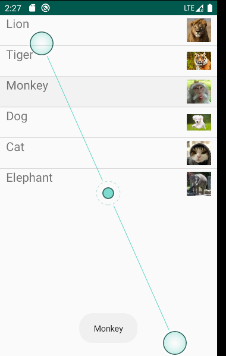
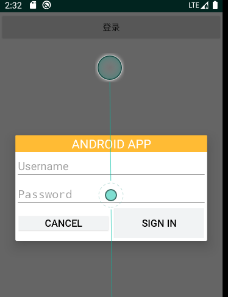

# Android UI


### 一.SimpleAdapter



在activity_main.xml中创建listview

创建一个layout实现每个列表的布局simple_item。包含一个ImageView和一个TextView。Adapter装配的时候要用。

```
 <TextView

            android:id="@+id/name"

            android:layout_width="wrap_content"

            android:layout_height="wrap_content"

            android:layout_weight="1"

            android:paddingLeft="10dp"

            android:textSize="20sp" />

        <ImageView

            android:layout_width="50dp"

            android:layout_height="50dp"

            android:id="@+id/header"

            android:paddingRight="10dp" />

```

将图片放到drawable中

定义hashmap存放资源

```
 List<Map<String, Object>> listems = new ArrayList<Map<String, Object>>();
        for (int i = 0; i < names.length; i++) {
            Map<String, Object> listem = new HashMap<String, Object>();
            listem.put("header", imageIds[i]);
            listem.put("name", names[i]);
            listems.add(listem);
        }
```

创建构造器

```
 SimpleAdapter simplead = new SimpleAdapter(this, listems,
                R.layout.simple, new String[]{"name", "header"},
                new int[]{R.id.name,R.id.header});
```


### 二.创建自定义布局的AlerDialog



在activity_main.xml中加一个按钮。主函数中创建一个alterdialog对象，用setview方法将alterlog设为alterdialog页面，再用show显示出alterdialog

```
View dialogView = View.inflate(MainActivity.this, R.layout.alterlog, null);
dialog.setView(dialogView);
dialog.show();
```

## 二.使用XML定义菜单

layout中定义一个文本视图

layout中添加toolbar：

```
<com.google.android.material.appbar.AppBarLayout
    android:layout_width="match_parent"
    android:layout_height="wrap_content">
    <androidx.appcompat.widget.Toolbar
        android:id="@+id/toolbar"
        android:layout_width="match_parent"
        android:layout_height="?attr/actionBarSize"
        android:background="?attr/colorPrimary" />
</com.google.android.material.appbar.AppBarLayout>
```

在oncreate()中使用ToolBar控件

```
Toolbar toolbar = findViewById(R.id.toolbar);
setSupportActionBar(toolbar);
```

最后MainActivity继承ActionBarActivity类或者AppCompatActivity类。


五.创建上下文操作模式的上下文菜单

上下文操作模式是Android3.0以后添加新特性，是上下文菜单的首选模式。

设计基本上分为两种：

- 针对单个任意视图的上下文操作。
- 针对 ListView 或 GridView 中项目组的批处理上下文操作（允许用户选择多个项目并针对所有项目执行操作）。

如果在 ListView 或 GridView 中有一组项目（或 AbsListView 的其他扩展），且需要允许用户执行批处理操作，则应：

- 实现 AbsListView.MultiChoiceModeListener 接口，并使用 setMultiChoiceModeListener() 为视图组设置该接口。在侦听器的回调方法中，您既可以为上下文操作栏指定操作，也可以响应操作项目的点击事件，还可以处理从 ActionMode.Callback 接口继承的其他回调。
- 使用 CHOICE_MODE_MULTIPLE_MODAL 参数调用 setChoiceMode()。

