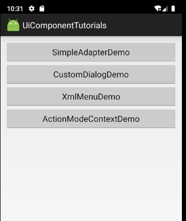
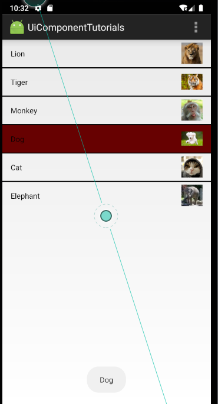
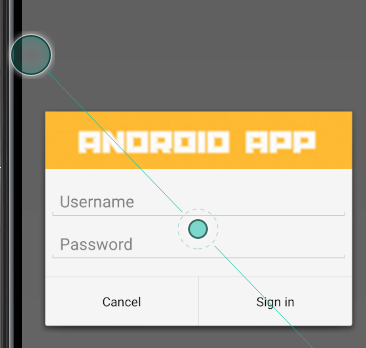
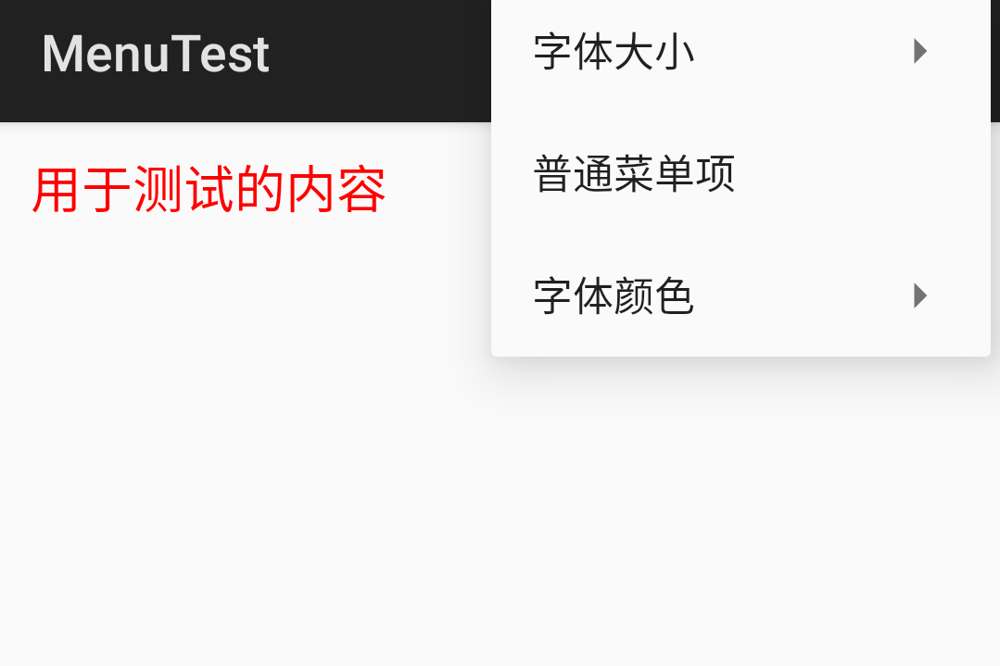
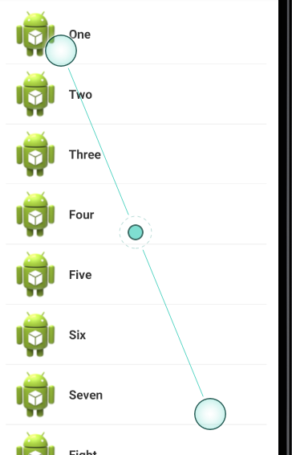

# Android UI

### 一.导航界面

其中SimpleAdapterDemo演示了SimpleAdapter的用法

CustomDialogDemo演示了自定义布局的AlerDialog的用法

XmlMenuDemo演示了XML定义菜单的用法

ActionMode演示了如何使用ActionMode形式的上下文菜单

### 二.SimpleAdapter

### 三.创建自定义布局的AlerDialog

四.使用XML定义菜单

五.创建上下文操作模式的上下文菜单

