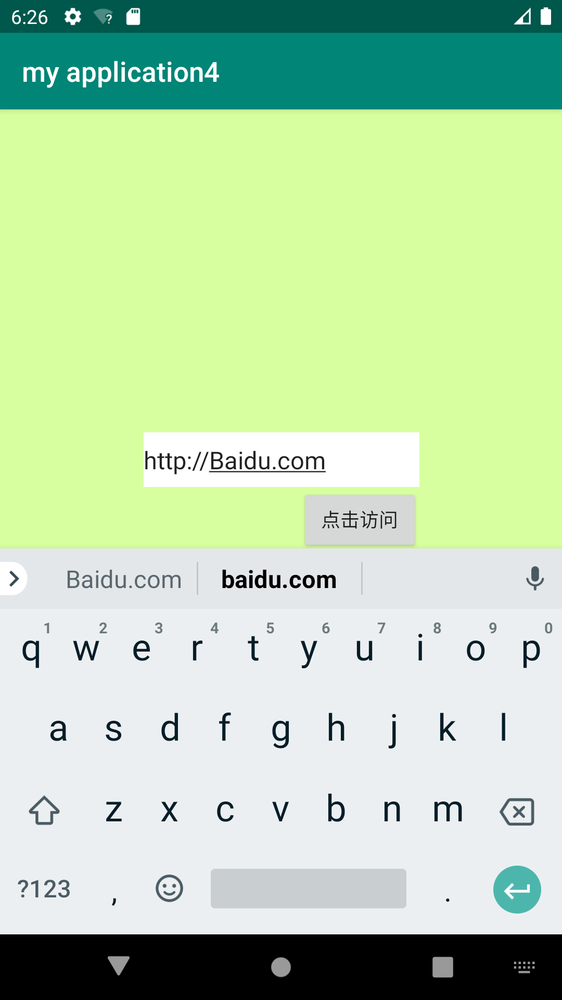
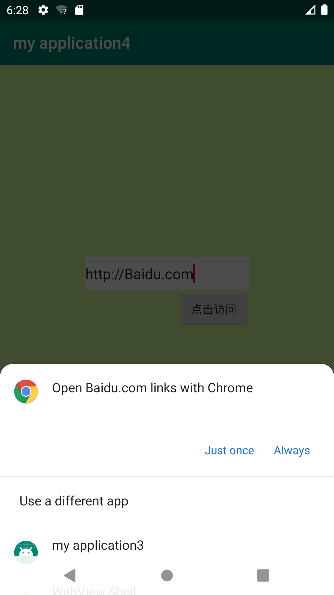
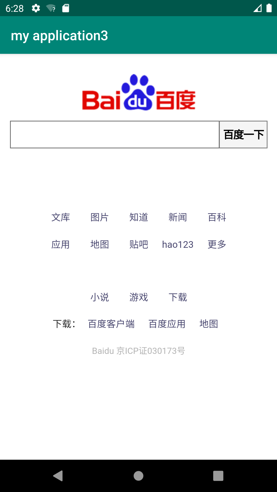

# 实验四：Intent

**1.自定义WebView验证隐式Intent的使用**

**2.新建工程获取URL地址并启动Intent**







步骤：1.先创建一个工程，用来启动Intent的调用来打开目标网址

2.在activity_main中添加edittext和一个按钮

```
<Button
        android:id="@+id/btn_browse"
        android:layout_width="wrap_content"
        android:layout_height="wrap_content"
        android:text="@string/btn_browse"
        android:useLevel="true"
        app:layout_constraintHorizontal_bias="0.678"
        app:layout_constraintLeft_toLeftOf="parent"
        app:layout_constraintRight_toRightOf="parent"
        app:layout_constraintTop_toBottomOf="@+id/editText" />
    <EditText
        android:id="@+id/editText"
        android:layout_width="202dp"
        android:layout_height="40dp"
        android:background="@color/colorWite"
        android:hint="@string/edit_url_hint"
        app:layout_constraintBottom_toBottomOf="parent"
        app:layout_constraintHorizontal_bias="0.502"
        app:layout_constraintLeft_toLeftOf="parent"
        app:layout_constraintRight_toRightOf="parent"
        app:layout_constraintTop_toTopOf="parent"
        app:layout_constraintVertical_bias="0.419" />
```

3.在MainActivity指定视图，并为按钮增加点击事件监听，获取输入框内的内容，将其解析为Uri对象，作为Intent的data，并设置Intent的动作为Intent.ACTION_VIEW。

```
protected void onCreate(Bundle savedInstanceState) {
    super.onCreate(savedInstanceState);
    setContentView(R.layout.activity_main);
    urlEditText = findViewById(R.id.editText);
    goButton = findViewById(R.id.btn_browse);
    goButton.setOnClickListener(new View.OnClickListener() {
        @Override
        public void onClick(View view) {
            //获取网址
            String url = urlEditText.getText().toString();
            Intent intent = new Intent();
            //将url字符串解析为uri对象
            //设置data
            intent.setAction(Intent.ACTION_VIEW);
            intent.setData(Uri.parse(url));
            //设置动作为ACTION_VIEW，为了启动隐式Intent
            startActivity(intent);
        }
    });
```

4.在创建一个工程，用于自定义WebView来作为一个第三方浏览器

5.创建activity_browser.xml，添加一个WebView组件

```
<?xml version="1.0" encoding="utf-8"?>
<LinearLayout xmlns:android="http://schemas.android.com/apk/res/android"
    android:orientation="vertical" android:layout_width="match_parent"
    android:layout_height="match_parent">
    <WebView
        android:layout_width="match_parent"
        android:layout_height="match_parent"
        android:id="@+id/webView"></WebView>
</LinearLayout>
```

6.创建BrowserActivity，指定view为activity_browser.xml，并使用getIntent()方法获取Intent，再获取data，通过data.getScheme(), data.getHost(), data.getPath()这三个方法分别获取协议、主机名和路径，并作为Url对象的参数。
还需要重新设置WebViewClien对象，并重写该对象的shouldOverrideUrlLoading()方法来防止再使用第webView以外的第三方浏览器。

```
protected void onCreate(Bundle savedInstanceState) {
    super.onCreate(savedInstanceState);
    setContentView(R.layout.activity_browse);
    webView = findViewById(R.id.webView);
    webView.getSettings().setJavaScriptEnabled(true);
    Intent intent = getIntent();
    Uri data = intent.getData();
    URL url = null;
    try {
        //创建一个URL对象，参数分别为协议，主机名，路径
        url = new URL(data.getScheme(), data.getHost(), data.getPath());
    } catch (Exception e) {
        e.printStackTrace();
    }
    //WebView加载web资源
    webView.loadUrl(url.toString());
    //覆盖WebView默认使用第三方或系统默认浏览器打开网页的行为，使网页用WebView打开
    webView.setWebViewClient(new WebViewClient(){
        @Override
        public boolean shouldOverrideUrlLoading(WebView view, String url) {
            //返回值是true的时候控制去WebView打开，为false调用系统浏览器或第三方浏览器
            view.loadUrl(url);
            return true;
        }
    });
```

7.在AndroidManifest.xml文件中注册BrowserActivity，设置其意图过滤器。还要添加uses-permission来使用网络。category.DEFAULT一定要设置，不然在选择浏览器时看不到该应用。

```
    <activity android:name=".BrowserActivity">
        <intent-filter>
            <action android:name="android.intent.action.VIEW" />
            <category android:name="android.intent.category.DEFAULT" />
            <category android:name="android.intent.category.BROWSABLE" />
            <data android:scheme="http" />
        </intent-filter>
    </activity>
</application>
<uses-permission android:name="android.permission.INTERNET" />
```