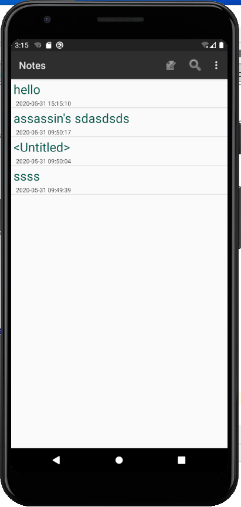
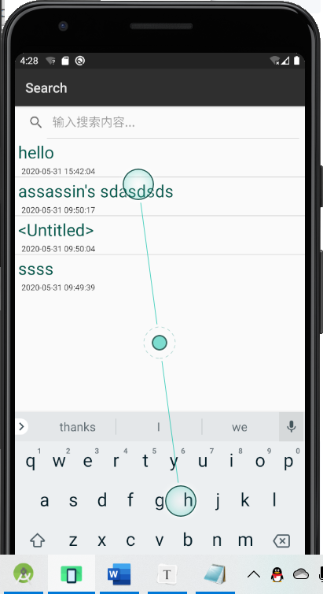

# 期中实验：notepad

### 添加时间

##### noteslist_item.xml中添加textview

```
<TextView
    android:id="@+id/text2"
    android:layout_width="match_parent"
    android:layout_height="match_parent"
    android:textAppearance="?android:attr/textAppearanceLarge"
    android:textSize="12dp"
    android:gravity="center_vertical"
    android:paddingLeft="10dip"
    android:singleLine="true"
    android:layout_weight="1"
    android:layout_margin="0dp"
    />
```

##### noteeditor.java中把获得时间的方法添加到updatenote函数中，并且添加时间参数，将参数插入values

```
private final void updateNote(String text, String title) {
    ContentValues values = new ContentValues();
    Date nowTime = new Date(System.currentTimeMillis());
    SimpleDateFormat sdFormatter = new SimpleDateFormat("yyyy-MM-dd HH:mm:ss");
    String retStrFormatNowDate = sdFormatter.format(nowTime);
     values.put(NotePad.Notes.COLUMN_NAME_MODIFICATION_DATE, retStrFormatNowDate);
```

##### 修改projection 添加COLUMN_NAME_MODIFICATION_DATE对象

```
private static final String[] PROJECTION = new String[] {
        NotePad.Notes._ID, // 0
        NotePad.Notes.COLUMN_NAME_TITLE, // 1
        NotePad.Notes.COLUMN_NAME_MODIFICATION_DATE,
```

##### 修改SimpleCursorAdapter的dataColumns和viewIDs的相关值。

```
private String[] dataColumns = { NotePad.Notes.COLUMN_NAME_TITLE ,  NotePad.Notes.COLUMN_NAME_MODIFICATION_DATE } ;
    private int[] viewIDs = { android.R.id.text1 , R.id.times };
```



### 查询框

##### list_options_menu.xml中添加

```
<item
    android:id="@+id/menu_search"
    android:title="Search"
    android:icon="@android:drawable/ic_search_category_default"
    android:showAsAction="always"
    />
```

##### NotesList中onOptionsItemSelected方法，在switch中添加搜索的case语句

```
case R.id.menu_search:
    Intent intent = new Intent();
    intent.setClass(NotesList.this,NoteSearch.class);
    NotesList.this.startActivity(intent);
    return true;
```

##### 新建一个名为NoteSearch的activity用来显示跳转的搜索界面的内容和功能。在安卓中有个用于搜索控件：SearchView，可以把SearchView跟ListView相结合，动态地显示搜索结果.

##### NoteSearch.java文件的布局文件note_search_list.xml

```
<?xml version="1.0" encoding="utf-8"?>
<LinearLayout xmlns:android="http://schemas.android.com/apk/res/android"
    android:orientation="vertical" android:layout_width="match_parent"
    android:layout_height="match_parent">

    <SearchView
        android:id="@+id/search_view"
        android:layout_width="match_parent"
        android:layout_height="wrap_content"
        android:iconifiedByDefault="false"
        android:queryHint="输入搜索内容..."
        android:layout_alignParentTop="true">
    </SearchView>

    <ListView
        android:id="@android:id/list"
        android:layout_width="match_parent"
        android:layout_height="wrap_content">
    </ListView>

</LinearLayout>
```

##### NoteSearch.java

```
package com.example.mynotepad;

import android.app.ListActivity;
import android.content.ContentUris;
import android.content.Intent;
import android.database.Cursor;
import android.net.Uri;
import android.os.Bundle;
import android.view.View;
import android.widget.ListView;
import android.widget.SearchView;

public class NoteSearch extends ListActivity  implements SearchView.OnQueryTextListener {

    private static final String[] PROJECTION = new String[]{
            NotePad.Notes._ID, // 0
            NotePad.Notes.COLUMN_NAME_TITLE, // 1
            NotePad.Notes.COLUMN_NAME_MODIFICATION_DATE, // 时间
            NotePad.Notes.COLUMN_NAME_BACK_COLOR //颜色
    };

    @Override
    protected void onCreate(Bundle savedInstanceState) {
        super.onCreate(savedInstanceState);
        setContentView(R.layout.note_search_list);
        Intent intent = getIntent();
        if (intent.getData() == null) {
            intent.setData(NotePad.Notes.CONTENT_URI);
        }
        SearchView searchview = (SearchView) findViewById(R.id.search_view);
        searchview.setOnQueryTextListener(NoteSearch.this);  //为查询文本框注册监听器
    }

    @Override
    public boolean onQueryTextSubmit(String query) {
        return false;
    }

    @Override
    public boolean onQueryTextChange(String newText) {

        String selection = NotePad.Notes.COLUMN_NAME_TITLE + " Like ? ";

        String[] selectionArgs = {"%" + newText + "%"};

        Cursor cursor = managedQuery(
                getIntent().getData(),            // Use the default content URI for the provider.
                PROJECTION,                       // Return the note ID and title for each note. and modifcation date
                selection,                        // 条件左边
                selectionArgs,                    // 条件右边
                NotePad.Notes.DEFAULT_SORT_ORDER  // Use the default sort order.
        );

        String[] dataColumns = {NotePad.Notes.COLUMN_NAME_TITLE, NotePad.Notes.COLUMN_NAME_MODIFICATION_DATE};
        int[] viewIDs = {android.R.id.text1, R.id.text2};

        MyCursorAdapter adapter = new MyCursorAdapter(
                this,
                R.layout.noteslist_item,
                cursor,
                dataColumns,
                viewIDs
        );
        setListAdapter(adapter);
        return true;
    }

    @Override
    protected void onListItemClick(ListView l, View v, int position, long id) {

        // Constructs a new URI from the incoming URI and the row ID
        Uri uri = ContentUris.withAppendedId(getIntent().getData(), id);

        // Gets the action from the incoming Intent
        String action = getIntent().getAction();

        // Handles requests for note data
        if (Intent.ACTION_PICK.equals(action) || Intent.ACTION_GET_CONTENT.equals(action)) {

            // Sets the result to return to the component that called this Activity. The
            // result contains the new URI
            setResult(RESULT_OK, new Intent().setData(uri));
        } else {

            // Sends out an Intent to start an Activity that can handle ACTION_EDIT. The
            // Intent's data is the note ID URI. The effect is to call NoteEdit.
            startActivity(new Intent(Intent.ACTION_EDIT, uri));
        }
    }
}
```

#####  最后要在AndroidManifest.xml注册NoteSearch：

```
<!--添加搜索activity-->
        <activity
            android:name="NoteSearch"
            android:label="Search">
        </activity>
```



